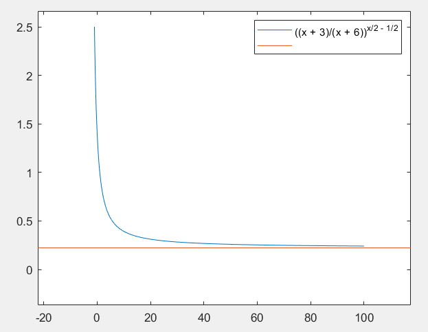
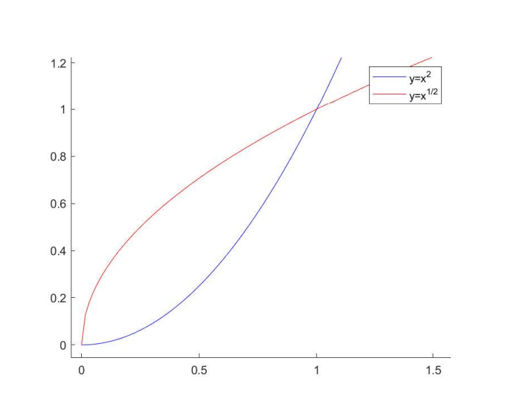
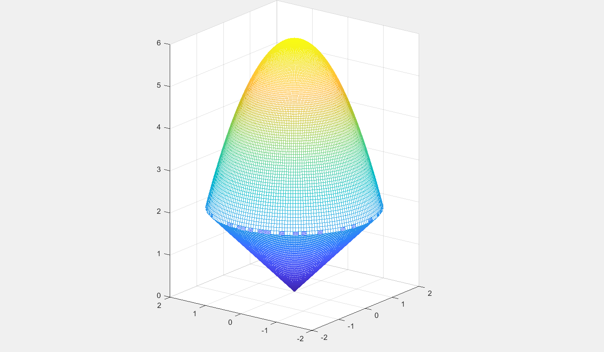
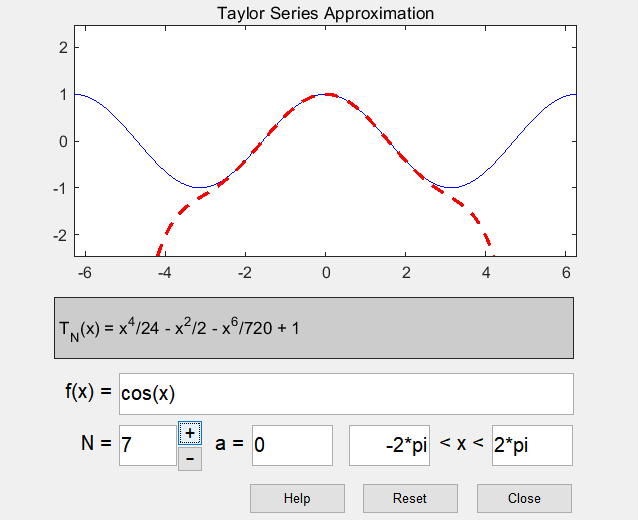

# MATLAB在高等数学以及线性代数中的运用
## 线性代数中的应用
### 行列式求值
1. $$\begin{vmatrix}a &b  &c \\b &c  &a \\c &a  &b\end{vmatrix} \hspace{50cm}$$
线性代数求解方法 :
$$
\begin{vmatrix}
  a &b  &c \\
  b &c  &a \\
  c &a  &b
\end{vmatrix} 
= acb + bca + cba - c^3 - a^3 -b^3\hspace{50cm}\\
$$
MATLAB求解方法：
```m
syms a b c
A=[a b c;b c a;c a b];
detA = det(A)

%运行结果
detA = - a^3 + 3*a*b*c - b^3 - c^3
```
2. $$\begin{vmatrix}1   &1    &1    &1 \\x   &a    &b    &c \\x^2 &a^2  &b^2  &c^2 \\x^3 &a^3  &b^3  &c^3\end{vmatrix}=0,其中a,b,c互不相等\hspace{50cm}$$
线性代数求解方法 :
$$
\begin{aligned}
四阶范德蒙德行列式可得，原式=(x-a)(x-b)(x-c)(a-b)(a-c)(b-c)=0
\end{aligned}
$$
MATLAB求解方法：
```m
syms x a b c
A = [1 1 1 1;x a b c;x^2 a^2 b^2 c^2;x^3 a^3 b^3 c^3];
detA = factor(det(A)) %求解并因式分解

%运行结果
detA = [-1, c - x, b - x, b - c, a - x, a - c, a - b]
```
<br>
----

### 基本运算
3. $$求A=\begin{pmatrix}2 &1 &4 &0\\1 &-1 &3 &4\\\end{pmatrix}\begin{pmatrix}1 &3 &1 \\0 &-1 &2 \\1 &-3 &1 \\4 &0 &-2 \\\end{pmatrix}的值 \hspace{50cm}$$
线性代数求解方法 :
$$
\begin{aligned}
A &=\begin{pmatrix}
2 &1 &4 &0\\
1 &-1 &3 &4\\
\end{pmatrix}
\begin{pmatrix}
1 &3 &1 \\
0 &-1 &2 \\
1 &-3 &1 \\
4 &0 &-2 \\
\end{pmatrix} \\
&= \begin{pmatrix}
6  &-7  &8 \\
20  &-5  &-6
\end{pmatrix}
\end{aligned} \hspace{50cm}
$$
MATLAB求解方法：
```m
A = [2 1 4 0;1 -1 3 4]*[1 3 1;0 -1 2;1 -3 1;4 0 -2]

%运行结果
A =

     6    -7     8
    20    -5    -6
```

4. 矩阵转置
线性代数求解方法 :
$$
\begin{aligned}
&A = \begin{pmatrix}
a  &b  &c  &d \\
e  &f  &g  &h
\end{pmatrix} \\
&A'= \begin{pmatrix}
a &e \\
b &f \\ 
c &g \\
d &h
\end{pmatrix} \\
\end{aligned} \hspace{50cm}\\
$$
MATLAB求解方法：
```m
syms a b c d e f g h
A=[a b c d;e f g h];
A'

%运行结果
ans =
 
[conj(a), conj(e)]
[conj(b), conj(f)]
[conj(c), conj(g)]
[conj(d), conj(h)]

```

5. $$A=\begin{pmatrix}\lambda  &0  &1 \\0 &\lambda &0 \\0 &0  &\lambda\end{pmatrix}求A^n\hspace{50cm}$$
线性代数求解方法 :
$$
\begin{aligned}
&A=\begin{pmatrix}
 \lambda  &0  &1 \\
 0 &\lambda &0 \\
 0 &0  &\lambda
\end{pmatrix}\\
&A^2=\begin{pmatrix}
 \lambda^2  &0  &2\lambda \\
 0 &\lambda^2 &0 \\
 0 &0  &\lambda^2
\end{pmatrix}\\
&A^3=\begin{pmatrix}
 \lambda^3  &0  &3\lambda^2 \\
 0 &\lambda^3 &0 \\
 0 &0  &\lambda^3
\end{pmatrix}\\
&总结归纳可知：A^n=\begin{pmatrix}
 \lambda^n  &0  &n\lambda^{n-1} \\
 0 &\lambda^n &0 \\
 0 &0  &\lambda^n
\end{pmatrix}\\
\end{aligned} \hspace{50cm}\\
$$
MATLAB求解方法：
```m
syms x n
A = [x 0 1;0 x 0;0 0 x];
An = A^n;

%运行结果
An =
 
[exp(n*log(x)),             0, (n*exp(n*log(x)))/x]
[            0, exp(n*log(x)),                   0]
[            0,             0,       exp(n*log(x))]

%进一步简化
simplify (An)

%运行结果
An =
 
[x^n,   0, n*x^(n - 1)]
[  0, x^n,           0]
[  0,   0,         x^n]
 
```

<br>
----

### 矩阵求逆
6. $$求方阵A=\begin{pmatrix}1  &2  &-1 \\3  &4  &-2 \\5  &-4  &1\end{pmatrix}的逆矩阵\hspace{50cm}$$
线性代数求解方法 :
$$
|A|=2\neq 0 A可逆 \hspace{50cm}\\
A^{-1} = \frac{1}{|A|}A^*=\frac{1}{2}\begin{pmatrix}
-4  &2  &0 \\
-13  &6  &-1 \\
-32  &14  &-2
\end{pmatrix}
=
\begin{pmatrix}
-2  &1  &0 \\
-\frac{13}{2}  &3  &-\frac{1}{2} \\
-16  &7  &-1
\end{pmatrix} \hspace{50cm}
$$
MATLAB求解方法：

```m
A = [1 2 -1;3 4 -2;5 -4 1];
A_inv = inv(A)

%运行结果
A_inv =

   -2.0000    1.0000    0.0000
   -6.5000    3.0000   -0.5000
  -16.0000    7.0000   -1.0000
```


7. $$求方阵A=\begin{pmatrix}\cos\theta   &-\sin\theta\\\sin\theta  &\cos\theta\end{pmatrix}的逆矩阵 \hspace{50cm}$$
线性代数求解方法 :
$$
\begin{aligned}
A^{-1}=\frac{1}{\cos^2\theta + \sin^2\theta}
\begin{pmatrix}
\cos\theta   &\sin\theta\\
-\sin\theta  &\cos\theta
\end{pmatrix}
=
\begin{pmatrix}
\cos\theta   &\sin\theta\\
-\sin\theta  &\cos\theta
\end{pmatrix}
\end{aligned} \hspace{50cm}\\
$$
MATLAB求解方法：

```m
syms x
A = [cos(x) -sin(x);sin(x) cos(x)];
A_inv = inv(A);
A_inv = simplify(A_inv) %进一步化简三角函数

%运行结果
A_inv =

[ cos(x), sin(x)]
[-sin(x), cos(x)]
```

<br>
----

### 矩阵的秩
8. $$A=\begin{pmatrix}1 &2  &1  &3\\4 &-1  &-5  &-6\\1 &-3  &-4  &-7\\2 & 1 &-1&0\end{pmatrix}\hspace{50cm}$$
线性代数求解方法 :
$$
\begin{aligned}
&A=\begin{pmatrix}
 1 &2  &1  &3 \\
 4 &-1  &-5  &-6 \\
 1 &-3  &-4  &-7 \\
 2 & 1 &-1  &0
\end{pmatrix}
\to 
\begin{pmatrix}
 1 &2  &1  &3 \\
 0 &-9  &-9  &-18 \\
 0 &-5  &-5  &-11 \\
 0 &-3 &-3  &-6
\end{pmatrix} 
\to 
\begin{pmatrix}
 1 &2  &1  &3 \\
 0 &1  &1  &2 \\
 0 &1  &1  &2 \\
 0 &1  &1  &2 \\
\end{pmatrix} 
&\to 
\begin{pmatrix}
 1 &2  &1  &3 \\
 0 &1  &1  &2 \\
 0 &0  &0  &0 \\
 0 &0  &0  &0 \\
\end{pmatrix} \\
&\therefore R(A)=2
\end{aligned}\hspace{50cm}\\
$$
MATLAB求解方法：
```m
A = [1 2 1 3;4 -1 -5 -6;1 -3 -4 -7;2 1 -1 0];
A_rank = rank(A)

%运行结果
A_rank = 2
```

<br>
----

### 特征值特征向量
9. $$求矩阵A=\begin{pmatrix}2  &-1  &2 \\5  &-3  &3 \\-1  &0  &-2\end{pmatrix}的特征值 \hspace{50cm}$$
线性代数求解方法 :
$$
\begin{aligned}
&A=\begin{pmatrix}2  &-1  &2 \\5  &-3  &3 \\-1  &0  &-2\end{pmatrix}\\
&|A-\lambda E|= \begin{vmatrix}
 2-\lambda  &-1  &2 \\
 5 &-3- \lambda  &3 \\
 -1 &0  & -2-\lambda
\end{vmatrix}
= \begin{vmatrix}
 2-\lambda  &-1  & \lambda^2-2 \\
 5 &-3- \lambda  &-7-5 \lambda \\
 -1 &0  & -0\\
\end{vmatrix} \\
&=\begin{vmatrix}
 -1  &\lambda^2-2   \\
3+\lambda  &7+5 \lambda    
\end{vmatrix}
=-(1 + \lambda)^3\\
&\therefore \lambda_1=\lambda_2=\lambda_3=-1
\end{aligned}\hspace{50cm}\\
$$
MATLAB求解方法：
```m
A =  [2 -1 2;5 -3 3;-1 0 -2];
d=eig(A)

%运行结果
d =

  -1.0000 + 0.0000i
  -1.0000 + 0.0000i
  -1.0000 - 0.0000i
```

10. $$求矩阵A=\begin{pmatrix}4  &2  &-5 \\6  &4  &-9 \\5  &3  &-7\end{pmatrix}的特征值特征向量 \hspace{50cm}$$
线性代数求解方法 :
$$
\begin{aligned}
&A=\begin{pmatrix}
4  &2  &-5 \\
6  &4  &-9 \\
5  &3  &-7
\end{pmatrix} \\
&|\lambda E -A | = \begin{vmatrix}
 \lambda-4  &-2  &5 \\
 -6 &\lambda-4  &9 \\
 -5 &-3  &\lambda+7
\end{vmatrix}
=0 \\
&\lambda^2(\lambda-1)=0 \\
&\lambda_1=1,\lambda_2=0,\lambda_3=0 \\
&当\lambda _1 =0
E-A=\begin{pmatrix}
-3  &-2  &5 \\
-6  &-3  &9 \\
-5  &-3  &8
\end{pmatrix}
=\begin{pmatrix}
1  &0  &-1 \\
0  &1  &-1 \\
0  &0  &0
\end{pmatrix}\\
&(E-A)x=\begin{pmatrix}
1  &0  &-1 \\
0  &1  &-1 \\
0  &0  &0
\end{pmatrix}
\begin{pmatrix}
x_1 \\
x_2 \\
x_3 
\end{pmatrix}
=0\\
&令x_1=0\\
&\xi_1 = \begin{pmatrix}
1 \\
1 \\
1 
\end{pmatrix}\\
&同理\xi_2= \xi_3 = \begin{pmatrix}
1 \\
3 \\
2 
\end{pmatrix}\\
\end{aligned}\hspace{50cm}\\
$$
MATLAB求解方法：
```m
A =  [4 2 -5;6 4 -9;5 3 -7];
d=eig(A)
[V,D]=eig(A);
V

%运行结果
D =

   1.0000
   0.0000
   0.0000

V =

   0.5774   0.2673   0.2673
   0.5774   0.8018   0.8018
   0.5774   0.5345   0.5345

```

<br>
----

### 求解矩阵方程
11. $$A=\begin{pmatrix}1  &-1  &0 \\0  &1  &-1 \\-1  &0  &1\end{pmatrix},AX=2X+A,求X\hspace{50cm}$$
线性代数求解方法 :
$$
\begin{aligned}
&AX=2X+A \to (A-2E)X = A\\
&(A-2E,A)=\begin{pmatrix}
-1 &-1 &0 &1 &-1 &0 \\
0 &-1 &-1 &0 &1 &-1 \\
-1 &0 &-1 &-1 &0 &1 \\
\end{pmatrix}
\to 
\begin{pmatrix}
1 &1 &0 &-1 &1 &0 \\
0 &1 &1 &0 &-1 &1 \\
0 &1 &-1 &-2 &1 &1 \\
\end{pmatrix}
\to 
\begin{pmatrix}
1 &0 &-1 &-1 &2 &-1 \\
0 &1 &1 &0 &-1 &1 \\
0 &0 &-2 &-2 &2 &0 \\
\end{pmatrix}
\to 
\begin{pmatrix}
1 &0 &0 &0 &1 &-1 \\
0 &1 &0 &-1 &0 &1 \\
0 &0 &1 &1 &-1 &0 \\
\end{pmatrix}\\
&\therefore A-2E 可逆，X=(A-E)^{-1}A = 
\begin{pmatrix}
0 &1 &-1 \\
-1 &0 &1 \\
1 &-1 &0 \\
\end{pmatrix}\\
\end{aligned}\hspace{50cm}\\
$$
MATLAB求解方法：
```m
A = [1 -1 0;0 1 -1;-1 0 1];
E = [1 0 0;0 1 0;0 0 1];
A_2E_inv =inv(A-2*E);
X =  A_2E_inv*A

%运行结果
X =

     0     1    -1
    -1     0     1
     1    -1     0
```

12. $$\left\{\begin{aligned}2x_1 &+ 3x_2 &= 8 \\x_1 &+ 3x_1 &= 7  \\\end{aligned}\right.\hspace{50cm}$$
线性代数求解方法 :
$$
\begin{aligned}
&\left\{
  \begin{aligned}
  2x_1 &+ 3x_2 &= 8 \\
  x_1 &+ 3x_1 &= 7  \\
  \end{aligned}
\right.
\Rightarrow
\begin{pmatrix}
2 &3 &8 \\
1 &3 &7 
\end{pmatrix}\\
&\to 
\begin{pmatrix}
1 &0 &1 \\
1 &3 &7 
\end{pmatrix}
\to 
\begin{pmatrix}
1 &0 &1 \\
0 &1 &2 
\end{pmatrix}\\
&\Rightarrow
\left\{
  \begin{aligned}
  x_1 = 1 \\
  x_2 = 2  \\
  \end{aligned}
\right.
\end{aligned} \hspace{50cm}\\
$$
MATLAB求解方法：
```m
A = [2 3;1 3];
B = [8 7]';
C = cat(2,A,B);
R = rref(C)

%运行结果
R =

     1     0     1
     0     1     2
%x1=1,x2=2
```

13. $$利用LU分解法求解\begin{pmatrix}1  &2  &3 \\2  &5  &2 \\3  &1  &5 \end{pmatrix} \begin{pmatrix}x_1   \\x_2   \\x_3   \\ \end{pmatrix} = \begin{pmatrix}14 \\18 \\20\end{pmatrix}\hspace{50cm}$$

$$
\begin{aligned}
&\begin{pmatrix}
 1  &2  &3 \\
 2  &5  &2 \\
 3  &1  &5 
\end{pmatrix} \begin{pmatrix}
x_1   \\
x_2   \\
x_3   \\ 
\end{pmatrix} = \begin{pmatrix}
 14 \\
 18 \\
20
\end{pmatrix}\\
&分解得到：A = \begin{pmatrix}
 1  &0  &0 \\
 2  &1  &0 \\
 3  &-5  &1 
\end{pmatrix} \begin{pmatrix}
 1  &2  &3 \\
 0  &1  &-4 \\
 0  &0  &-24 
\end{pmatrix} = LU \\

&Ly = \begin{pmatrix}
14 \\
18 \\
20
\end{pmatrix} \Rightarrow y = \begin{pmatrix}
14 \\
-10 \\
-72
\end{pmatrix} \\

&Ux = \begin{pmatrix}
14 \\
-10 \\
-72
\end{pmatrix} \Rightarrow x = \begin{pmatrix}
1 \\
2 \\
3
\end{pmatrix} \\
\end{aligned} \hspace{50cm}\\
$$
MATLAB求解方法：
```m
A = [1 2 3;2 5 2;3 1 5];
[L,U] = lu(A);
B = [14 18 20]';
x = U\(L\B)

%运行结果
x =

    1.0000
    2.0000
    3.0000
```

<br>
----

### 二次型和标准型
14. $$规范正交化下列向量组\alpha _1 = \begin{pmatrix}1 \\-1 \\0\end{pmatrix} ,\alpha _2 = \begin{pmatrix}-1 \\1 \\1\end{pmatrix} ,\alpha _3 = \begin{pmatrix}1 \\1 \\1\end{pmatrix}\hspace{50cm}$$
线性代数求解方法 :
$$
\begin{aligned}
&\alpha _1 = \begin{pmatrix}
1 \\
-1 \\
0
\end{pmatrix} ,
\alpha _2 = \begin{pmatrix}
-1 \\
1 \\
1
\end{pmatrix} ,
\alpha _3 = \begin{pmatrix}
1 \\
1 \\
1
\end{pmatrix} \\

&\beta _1 = \alpha _1 = \begin{pmatrix}
1 \\
-1 \\
0
\end{pmatrix} \\

&\beta _2= \alpha _2 - \frac{[\beta_1,\alpha _2]}{[\beta_1,\beta_1]} \beta _1  = \begin{pmatrix}
0 \\
0 \\
1
\end{pmatrix} \\

&\beta _3= \alpha _3 - \frac{[\beta_1,\alpha _3]}{[\beta_1,\beta_1]} \beta _1 - - \frac{[\beta_2,\alpha _3]}{[\beta_2,\beta_2]} \beta _2 = \begin{pmatrix}
1 \\
1 \\
0
\end{pmatrix} \\

&分别单位化得到：\\
&e_1=  \frac{1}{\sqrt 2} \begin{pmatrix}
1 \\
-1 \\
0
\end{pmatrix} ,
e_2=  \begin{pmatrix}
0 \\
0 \\
1
\end{pmatrix} ,
e_1=  \frac{1}{\sqrt 2} \begin{pmatrix}
1 \\
1 \\
0
\end{pmatrix} ,


\end{aligned}\hspace{50cm}\\
$$
MATLAB求解方法：
```m
alpha_1 = [1 -1 0];
alpha_2 = [-1 1 1];
alpha_3 = [1 1 1];
A = [alpha_1;alpha_2;alpha_3];
orth(A)

%运行结果
ans =

   -0.5207   -0.4271   -0.7392
    0.7558    0.1721   -0.6318
    0.3971   -0.8877    0.2332
```

15. $$求f=-2x_1x_2+2x_1x_3+2x_2x_3化为标准型的变换矩阵\hspace{50cm}$$
线性代数求解方法 :
$$
\begin{aligned}

&A=\begin{pmatrix}
 0  &-1  &1 \\
 -1 &0 &1 \\
 1 &1  &0
\end{pmatrix}\\

&|\lambda E-A| = \begin{vmatrix}
 \lambda &1  &-1 \\
 1 &\lambda  &-1 \\
 -1 &-1  &\lambda
\end{vmatrix}=(\lambda+2)(\lambda-1)^2\\

&特征值\lambda_1=-2,\lambda_2=\lambda_3=1\\

&\lambda_1=-2,\lambda_1 E-A = \begin{pmatrix}
 2 &1  &-1 \\
 1 &2  &-1 \\
 -1 &-1  &2
\end{pmatrix} \to \begin{pmatrix}
 1 &0  &1 \\
 0 &1  &1 \\
 0 &0  &0
\end{pmatrix}, \xi_1 = \begin{pmatrix}
 -1 \\
 -1 \\
 1
\end{pmatrix}, \\

&\lambda_2=1,\lambda_2 E-A = \begin{pmatrix}
 1 &1  &-1 \\
 1 &1  &-1 \\
 -1 &-1  &1
\end{pmatrix} \to \begin{pmatrix}
 1 &1  &-1 \\
 0 &0  &0 \\
 0 &0  &0
\end{pmatrix}, \xi_2 = \begin{pmatrix}
 -1 \\
 1 \\
 0
\end{pmatrix} \xi_3 = \begin{pmatrix}
 1 \\
 0 \\
 1
\end{pmatrix},\\

&单位正交化\gamma _1 = \frac{1}{\sqrt{3}}\begin{pmatrix}
 -1 \\
 -1 \\
 1
\end{pmatrix} \gamma _2 = \frac{1}{\sqrt{2}}\begin{pmatrix}
 -1 \\
 1 \\
 0
\end{pmatrix} \gamma _3 = \frac{1}{\sqrt{6}}\begin{pmatrix}
 1 \\
 1 \\
 2
\end{pmatrix} \\

&令 P = \begin{pmatrix}
 \gamma _1 \\
 \gamma _2 \\
 \gamma _3
\end{pmatrix}使P^{-1}AP=\Lambda= \begin{pmatrix}
 -2 &0 &0\\
 0 &1 &0 \\
 0 &0 &1
\end{pmatrix} ,x=Py化为标准型\\

&f = -2y_1^2 + y_2^2 + y_3^2,\\

&变换矩阵P = \begin{pmatrix}
 -\frac{1}{\sqrt{3}} &-\frac{1}{\sqrt{2}}  &\frac{1}{\sqrt{6}}\\
 -\frac{1}{\sqrt{3}}  &\frac{1}{\sqrt{2}}  &\frac{1}{\sqrt{6}}\\
 \frac{1}{\sqrt{3}}   &0  &\frac{2}{\sqrt{6}}
\end{pmatrix} \\
\end{aligned}\hspace{50cm}\\
$$
<b sy="&令y = \begin{pmatrix}
\frac{1}{\sqrt{2}} &0 &0 \\
0 &1 &0 \\
0 &0 &1
\end{pmatrix}z \\
&f = -z_1^2 +z_2^2 +z_3^2"></b>
MATLAB求解方法：
```m
A = [0 -1 1;-1 0 1;1 1 0];
[P,E] = eig(A);

%运行结果
P =

   -0.5774   -0.3938    0.7152
   -0.5774    0.8163   -0.0166
    0.5774    0.4225    0.6987


E =

   -2.0000         0         0
         0    1.0000         0
         0         0    1.0000
%P矩阵即为所求
```

<br>
----
<br>

## 高等数学中的应用
### 求极限
1. $$\lim_{x \to 2} \frac{5+x^2}{x-3} \hspace{50cm}$$
高等数学求解方法 :
$$
\begin{aligned}
 \lim_{x \to 2} \frac{5+x^2}{x-3} &= \frac{\lim_{x \to 2}5+x^2}{\lim_{x \to 2}x-3} \hspace{50cm}\\
 &= \frac{9}{-1} \\
 &= -9
\end{aligned}
$$
MATLAB求解方法：
```m
syms x
f = (5+x^2)/(x-3)
w = limit(f,2)

%运行结果
w = -9
```

2. $$\lim_{x \to \infty} (\frac{3+x}{6+x})^\frac{x-1}{2} \hspace{50cm}$$
高等数学求解方法 :
$$
\begin{aligned}
 \lim_{x \to \infty} (\frac{3+x}{6+x})^\frac{x-1}{2}&=
 \lim_{x \to \infty}[(1-\frac{3}{x+6})^{-\frac{x+6}{3}}]^{-\frac{3}{2}} \cdot \lim_{x \to \infty}(1-\frac{3}{x+6})^{-\frac{7}{2}} \hspace{50cm}\\
 &=e^{-\frac{3}{2}}
\end{aligned}
$$
MATLAB求解方法：
```m
syms x
f = ((3+x)/(6+x))^((x-1)/2)
w = limit(f,Inf)

%运行结果
w = exp(-3/2)
```


<br>
----

### 求微分

3. $$求函数y=x\sin 2x 的微分 \hspace{50cm}$$
高等数学求解方法 :
$$
\begin{aligned}
\mathrm{d}y &= {y}' \mathrm{d}x \hspace{50cm}\\
&= (\sin 2x + x \cos 2x \cdot 2) \mathrm{d}x \\
&= (\sin 2x + 2x\cos 2x) \mathrm{d}x
\end{aligned}
$$
MATLAB求解方法：
```m
syms x
y = x*sin(2*x) ;
w = diff(y,x,1)

%运行结果
w = sin(2*x) + 2*x*cos(2*x)
```
<br>
----

### 求导数
4. $$(\frac{\arcsin{x}}{\arccos{x}})' \hspace{50cm}$$
高等数学求解方法 :
$$
\begin{aligned}
(\frac{\arcsin{x}}{\arccos{x}})' & =
 \frac{\frac{1}{\sqrt[]{1-x^2} } \arccos x -\arcsin x (-\frac{1}{\sqrt[]{1-x^2} } )} {\arccos ^2x} \hspace{50cm}\\
& = \frac{\arccos x + \arcsin x}{\sqrt{1-x^2}\arccos ^2 x} \\ 
& = \frac{1}{\arccos{x}\sqrt{1-x^2}} + \frac{\arcsin{x}}{\arccos^2{x}\sqrt{1-x^2}}\\

\end{aligned}
$$
MATLAB求解方法：
```m
syms x
y = asin(x)/acos(x) ;
w = diff(y,1)

%运行结果
ans =1/(acos(x)*(1 - x^2)^(1/2)) + asin(x)/(acos(x)^2*(1 - x^2)^(1/2))
```

5. $$求二阶导：y=e^{-t}\sin t \hspace{50cm}$$
高等数学求解方法 :
$$
\begin{aligned}
y &= e^{-t}\sin t  \hspace{50cm}\\
y' &=e^{-t}(-1)\sin t + e^{-t} \cos t \\
&=  e^{-t}(\cos t - \sin t) \\
y'' &= e^{-t}(- \cos t + \sin t) + e^{-t}(-\cos t - \sin t) \\
&= e^{-t}(-2 \cos t) \\
&= -2e^{-t} \cos t
\end{aligned}
$$
MATLAB求解方法：
```m
syms x t
y = exp(-t)*sin(t);
w = diff(y,2)

%运行结果
w = -2*exp(-t)*cos(t)
```

<br>
----

### 求不定积分
6. $$求不定积分\int\sec x (\sec x - \tan x) \mathrm{d} x \hspace{50cm}$$ 
高等数学求解方法 :
$$
\begin{aligned}
\int\sec x (\sec x - \tan x) \mathrm{d} x &= \int \sec ^2 x \mathrm{d}x -\int \sec x \tan x \mathrm{d}x  \hspace{50cm}\\
&= \tan x - \sec x + C
\end{aligned}
$$
MATLAB求解方法：
```m
syms x
f = sec(x)*(sec(x)-tan(x));
F = int (f)

%运行结果
F = -2/(tan(x/2) + 1)
```


<br>
----

### 求定积分
7. $$求定积分:\int_{1}^{4}{\frac{\mathrm{d}x}{1+\sqrt{x}}} \hspace{50cm}$$
高等数学求解方法 :
$$
令u=\sqrt{x}，所以x=u^2,带入原式 \hspace{50cm}\\
\begin{aligned}
\int_{1}^{4}{\frac{\mathrm{d}x}{1+\sqrt{x}}} &= \int_{1}^{2}{\frac{2u\mathrm{d}u}{1+u}} \hspace{50cm}\\
&=[2u - 2 \ln(1+u)]_{1}^{2} \\
&=2 + 2\ln {\frac{2}{3}}
\end{aligned}
$$
MATLAB求解方法：
```m
syms x
f = 1/(1+x^0.5);
F = int(f,1,4)

%运行结果
 F = log(4/9) + 2   %matlab默认log的底为e
```
8. $$求定积分\int_{\frac{3}{4}}^{1}{\frac{\mathrm{d}x}{\sqrt{1-x}-1}} \hspace{50cm}$$
高等数学求解方法 :
$$
令u=\sqrt{1-x}，所以x=1-u^2,带入原式 \hspace{50cm}\\
\begin{aligned}
\int_{\frac{3}{4}}^{1}{\frac{\mathrm{d}x}{\sqrt{1-x}-1}} &= \int_{\frac{1}{2}}^{0}{\frac{-2u\mathrm{d}u}{u-1}} \hspace{50cm}\\
&=-2[u+\ln (1-u)]_{\frac{1}{2}}^{0} \\
&= 1-2\ln 2
\end{aligned}
$$
MATLAB求解方法：
```m
syms x
f = 1/((1-x)^0.5-1);
F = int(f,3/4,1)

%运行结果
F = 1 - log(4)  %matlab默认log的底为e
```
9. $$D是由两条抛物线y=\sqrt{x},y=x^2围成的闭合区域 \hspace{50cm}\\求二重积分:\iint\limits_{D}x\sqrt{y}\mathrm d\sigma\hspace{50cm}$$

高等数学求解方法 :
$$
D区域可以表示为： 
0 \leq x \leq 1 , x^2 \leq y \leq \sqrt{x} \hspace{50cm}\\
\begin{aligned}
\iint\limits_{D}x\sqrt{y}\mathrm d\sigma &= \int_{0}^{1} x \mathrm d x \int_{x^2}^{\sqrt{x}} \sqrt{y} \mathrm dy \hspace{50cm}\\
&= \int_{0}^{1} \frac{2}{3} x (y^{\frac{3}{2}}) |_{x^2}^{\sqrt x}  \mathrm d x \\
&= \frac{6}{55}
\end{aligned}
$$
MATLAB求解方法：

```m
syms x y
f = x*(y^0.5); %原函数
F = int(f,'y',x^2,x^0.5); %先对y积分
D = int(F,'x',0,1) %再对x积分

%运行结果
D = 6/55
```
10. $$利用三重积分计算曲面所围成立体体积z=6-x^2-y^2及z=\sqrt{x^2+y^2}\hspace{50cm}$$
高等数学求解方法 :
$$
\begin{aligned}
&\left\{
  \begin{aligned}
  z &= 6-x^2-y^2 \hspace{50cm}\\
  z &= \sqrt{x^2+y^2}  \\
  \end{aligned}
\right.\\
&\implies \sqrt{x^2+y^2}=2 \\
&\Omega 在xOy上投影D_{xy}=x^2+y^2 \leq 4 \\
&\Omega=\{(x,y,z)|\sqrt{x^2+y^2} \leq z \leq 6-(x^2+y^2),x^2+y^2 \leq 4\} \\
& \begin{aligned}
    V &= \iiint\limits_{\Omega}\mathrm d v \\
    &= \iint\limits_{D_{xy}}\mathrm d x \mathrm d y \int_{\sqrt{x^2+y^2}}^{6-(x^2+y^2)}\mathrm d z \\
    &=  \iint\limits_{D_{xy}} [6-(x^2+y^2)-\sqrt{x^2+y^2}] \mathrm d x \mathrm d y \\
    &= \int_{0}^{2\pi}\mathrm d \theta \int_{0}^{2}\mathrm (6-\rho^2-\rho) d \rho \\
    &= \frac{32}{3}\pi
  \end{aligned}
\end{aligned} \hspace{50cm}\\
$$

MATLAB求解方法：
```m
%绘制图像
[t,r] = meshgrid([0:0.01*pi:3*pi],[0:0.02:3]);
x = r.*cos(t);
y = r.*sin(t);
Z1 = sqrt(x.^2+y.^2);
Z2 = 6-x.^2-y.^2;
z1 = Z1;
z2 = Z2;
z1(Z1>Z2)=nan;
z2(Z1>Z2)=nan;
mesh(x,y,z1)
hold on
mesh(x,y,z2)
```

```m
syms x y
f1 = @(x,y,z) (x.^2+y.^2<=z.^2);
f2 = @(x,y,z) (x.^2+y.^2<=6-z);
V1 = triplequad(f1,-2,2,-2,2,0,2);
V2 = triplequad(f2,-2,2,-2,2,2,6);
V = V1 + V2

%运行结果
v = 33.5103 %经检验等于32/3*pi
```

<br>
----

### 求解常微分方程
11. $$求微分方程的通解 y'+y \tan x = \sin 2x \hspace{50cm}$$

高等数学求解方法 :
$$
\begin{aligned}
y &= e^{-\int{\tan x \mathrm d x}}(\int{\sin 2x e^{\int{\tan x \mathrm d x}}}\mathrm d x+C) \hspace{50cm}\\
&= \cos x (\int{\frac{\sin 2x}{\cos x}} \mathrm d x + C) \\
&= \cos x (\int{2 \sin x \mathrm d x}+C) \\
&= C \cos x - 2 \cos ^2 x = C \cos x - \cos(2x) - 1 \\
\end{aligned}
$$
MATLAB求解方法：
```m
syms x
y = dsolve('Dy+y*tan(x) = sin(2*x)','x')

%运行结果
y = C1*cos(x) - cos(2*x) - 1
```

<br>
----

### 求解带有初值条件的常微分方程
12. $$求微分方程满足已知初值条件的特解 y'' - y = 4xe^x , y|_{x=0}=0 , y'|_{x=0}=1 \hspace{50cm}$$

高等数学求解方法 :
$$
r^2 - 1 = 0 求解特征根r_{1,2}=±1，对应齐次线性方程的通解为: \hspace{50cm} \\
y = C_1e^x + C_2e^{-x} \\
\because f(x) = 4xe^x,\lambda = 1 ,\therefore 设y^* = xe^x(Ax+B) =e^x(Ax^2+Bx) 是原方程的一个特解，\hspace{50cm}\\
带入原方程得 \hspace{50cm}\\
4Ax+2A+2B=4x \\
\therefore A=1,B=-1 \\
\therefore y^* = e^x(x^2-x) \\
原方程的通解为： \hspace{50cm}\\
\begin{aligned}
&y = C_1 e^x + C_2 e^{-x} + e^x(x^2-x) \\
&y = e^x(x^2-x+C_1) + C_2e^{-x} \\
&y' = e^x(x^2+x-1+C_1) - C_2e^{-x}
\end{aligned}  \\
初值条件为x=0,y=0,y'=1带入得： \hspace{50cm}\\

\begin{aligned}
&\left\{
  \begin{aligned}
  &C_1 + C_2 = 0 \\
  &C_1 - C_2 -1 = 1 \\
  \end{aligned}
\right.\\
&\left\{
  \begin{aligned}
  C_1 &= 1 \\
  C_2 &= -1 \\
  \end{aligned}
\right.\\
\end{aligned} \\

\therefore 所求特解为: \hspace{50cm}\\
y = e^x (x^2-x+1) - e^{-x}
$$
MATLAB求解方法：
```m
syms x
y = dsolve('D2y - y = 4*x*exp(x)','y(0) = 0','Dy(0) = 1','x')

%运行结果
y = exp(x)/2 - exp(-x) + x^2*exp(x) - (exp(x)*(2*x - 1))/2
```
$$y = \frac{{\mathrm{e}}^x}{2}-{\mathrm{e}}^{-x}+x^2\,{\mathrm{e}}^x-\frac{{\mathrm{e}}^x\,\left(2\,x-1\right)}{2} = e^x (x^2-x+1) - e^{-x} 进一步化简后结果相同 \hspace{50cm}$$

<br>
----

### 级数求和
13. $$\frac{1}{1\cdot3}+\frac{1}{3\cdot5}+\frac{1}{5\cdot7}...+\frac{1}{(2n-1)(2n+1)}+... \hspace{50cm}$$
高等数学求解方法 :
$$
\begin{aligned}
a_n&=\frac{1}{2}(\frac{1}{2n-1}-\frac{1}{2n+1}) \hspace{50cm}\\
S_n&=\frac{1}{2}[1-\frac{1}{3}+\frac{1}{3})-\frac{1}{5}+...+\frac{1}{2n-1}-\frac{1}{2n+1}] \\
&=\frac{1}{2}[1-\frac{1}{2n+1}] \\
\lim_{n \to \infty}&S_n = \frac{1}{2}
\end{aligned}
$$
MATLAB求解方法：
```m
syms x n
symsum(1/((2*n-1)*(2*n+1)) , n,1,inf)

%运行结果
ans = 1/2
```

<br>
----


### 级数展开
14. $$将函数f(x)=\cos x 展开为泰勒级数\hspace{50cm}$$
高等数学求解方法 :
$$
\begin{aligned}
&f^{(n)}(x_0) = \cos (x_0+n\cdot\frac{\pi}{2}) (n=0,1,2...)\hspace{50cm}\\
&\cos x_0 + \cos (x_0+\frac{\pi}{2})(x-x_0) + \frac{\cos (x_0+\frac{\pi}{2})}{2!}(x-x_0)^2 +...+  \frac{\cos (x_0+\frac{n\pi}{2})}{n!}(x-x_0)^n
\end{aligned}
$$
MATLAB求解方法：
```m
syms x
f = cos(x);
taylortool(f)
```


<br>
----

### 因式分解
15. $$16x^4-72x^2+81\hspace{50cm}$$
数学方法 :
$$
\begin{aligned}
原式 &= (4x^2)^2-2(4m^2)\cdot9+9^2 \hspace{50cm}\\
&= (4m^2-9)^2 \\
&= (2m-3)^2(2m+3)^2
\end{aligned}
$$
MATLAB求解方法：
```m
factor(16*x^4-72*x^2+81)
 
%运行结果
ans = [2*x - 3, 2*x - 3, 2*x + 3, 2*x + 3]
```

<br>
----

## 总结
MATLAB是一种强大的计算机软件，可以在高等数学和线性代数中进行各种计算和分析。在工程方面，MATLAB可以帮助用户进行各种数据处理和可视化，包括图像处理，信号处理，控制系统设计等。
MATLAB还可以用于模拟各种工程系统，帮助用户预测系统的行为并优化设计。
MATLAB可以增强个人的计算能力和编程技能，使其在各种数学和工程领域的计算中能够更加熟练和高效。这对于个人在求职或者职业发展方面都是非常有帮助的。学习MATLAB还可以帮助个人更好地理解和应用各种数学模型和算法，提升个人的分析能力和解决问题的能力。这对于个人在学习和工作中遇到的各种挑战都是非常有价值的。

本次作业作业源码公开在

[](https://github.com/C7H10N2/Matlab-coursework_22)

[](https://github.com/C7H10N2/)